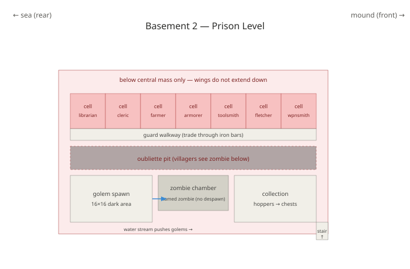
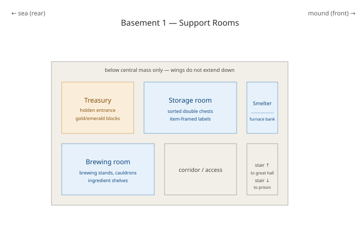
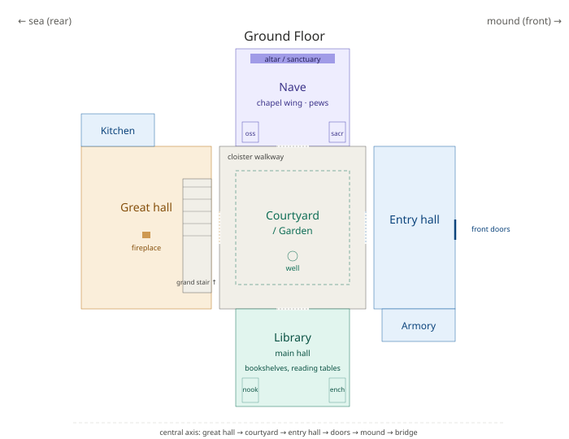
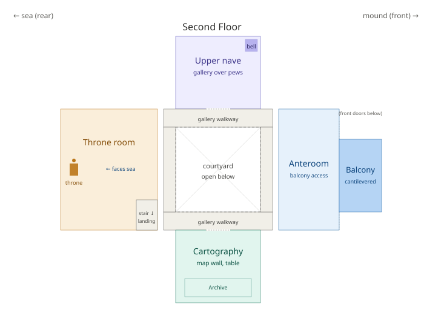
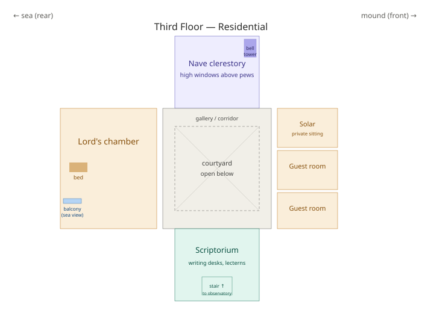
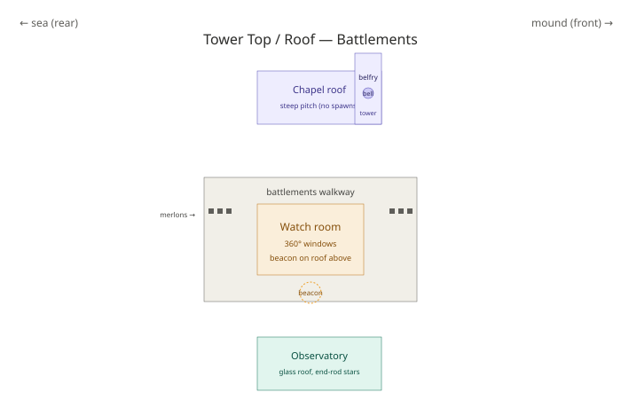
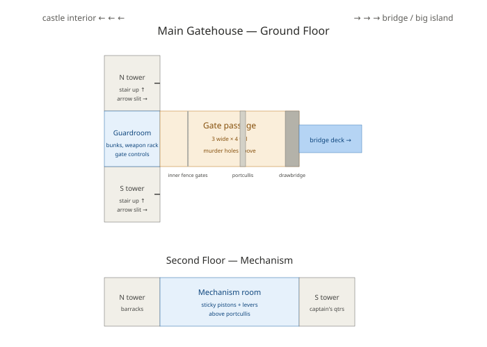

# Two-Island Castle Build Plan

*Minecraft Bedrock (Switch) — Seed: `-1814576922`*

**Seed map (Chunkbase):** [open the interactive map for this seed](https://www.chunkbase.com/apps/seed-map#seed=-1814576922&platform=bedrock_1_21_120&dimension=overworld&x=-72&z=-580&zoom=0.441) — use this to scout villages, monuments, strongholds, mansions, and other structures before travelling.

## Site Map

The player marker (right-of-center on the map, sitting on the small dark island) is your spawn/castle island. Coordinates are approximate — pull them exactly from Chunkbase when you plan expeditions.

**Key features visible in this frame:**

- **Your two-island site:** small landmass mid-frame with a village icon right next to the player marker. Deep ocean on all sides — great for the concentric-castle silhouette and for later ocean-monument work.
- **Mushroom island biome (bright magenta, ~1500–1800 blocks NW):** genuinely rare and extremely valuable. Mooshrooms give infinite mushroom stew and can be sheared for red mushrooms. Hostile mobs *do not spawn* in mushroom biomes — the biome itself is a safe zone. Worth a boat expedition early, even just to plant a bed and mark it on a map.
- **Nearest mainland to the west (~500–800 blocks):** at least two villages visible along the coast, plus more inland. Best early-game trade route target — close enough to sail there and back in one session.
- **Large eastern mainland (~400–600 blocks east):** village-dense, mixed biomes. Good candidate for a second trade hub and a nether-hub distant portal.
- **Snowy / icy biome (pale blue/white, ~1500–2500 blocks NE):** cold biome cluster. Icebergs, potentially frozen ocean, snowy plains villages. Good for packed ice (fast rails), snow, and blue ice for boat-highway travel.
- **Badlands / mesa (orange, ~500–800 blocks south):** rare biome. Gold generates at higher rates here, plus terracotta in multiple colors — great for aesthetic accents in the castle build. Also a strong candidate for a mining outpost.
- **Deep ocean surrounding the spawn island:** implies high probability of ocean monuments, shipwrecks, and buried treasure within a few thousand blocks. Not visible in this zoom — enable those overlays on Chunkbase to locate them.
- **Not visible in frame:** woodland mansions (usually far out), stronghold locations, ancient cities, trial chambers. Zoom out or re-center Chunkbase to scout these.

**Suggested exploration priority based on this map:**

1. **Nearest west-mainland village** — a short boat trip. Zombie-convert a librarian for discount trades, grab breeding stock.
2. **Mushroom island** — sail NW. Plant a bed there as a safe-zone respawn point, mark on a map. Even without immediate use, claiming it early is smart.
3. **Badlands to the south** — gold, terracotta, aesthetic materials for the castle.
4. **Eastern mainland** — second village hub, potential nether portal endpoint.
5. **Ocean monuments** — scout via Chunkbase overlay, plan a raid once you have Water Breathing potions.
6. **Ice biome** — packed ice for rails once you have a Silk Touch pickaxe.

---

## Table of Contents

- [Site Map](#site-map)
1. [Overview](#1-overview)
2. [Site Layout](#2-site-layout)
   - 2a. [Central Axis Composition](#2a-central-axis-composition)
     - [Tiered Town Center Mound](#tiered-town-center-mound)
     - [Bell placement](#bell-placement-resolved)
3. [Defensive Design: Concentric Walls](#3-defensive-design-concentric-walls)
   - [Small island (keep)](#small-island-keep)
   - [Main village island](#main-village-island-defense)
4. [The Channel](#4-the-channel)
5. [Bridges](#5-bridges)
   - 5a. [Main Gatehouse](#5a-main-gatehouse)
     - [Structure](#structure)
     - [Rooms](#rooms)
     - [Functional gate build](#functional-gate-build)
6. [Main Keep — Room List](#6-main-keep--room-list)
   - [Central Mass — Ground Floor](#central-mass--ground-floor)
   - [Chapel Wing](#chapel-wing-major-wing-off-central-mass)
   - [Library Wing](#library-wing-major-wing-opposite-chapel)
   - [Central Mass — Second Floor](#central-mass--second-floor-residential--ceremonial)
   - [Central Mass — Third Floor / Tower](#central-mass--third-floor--tower)
   - [Basement Level 1](#basement-level-1)
   - [Basement Level 2+](#basement-level-2)
   - 6a. [Keep Floor Plans](#6a-keep-floor-plans)
     - [Basement 2 — Prison / Iron Farm](#basement-2--prison--iron-farm-complex)
     - [Basement 1 — Treasury, Storage, Smelter, Brewing](#basement-1--treasury-storage-smelter-brewing)
     - [Ground Floor](#ground-floor)
     - [Second Floor](#second-floor)
     - [Third Floor](#third-floor)
     - [Tower Top / Roof](#tower-top--roof)
     - [Main Gatehouse — Ground Floor + Upper](#main-gatehouse--ground-floor--upper)
7. [Support Structures (Small Island)](#7-support-structures-small-island)
8. [Main Village Island Structures](#8-main-village-island-structures)
   - [Bridge Landing Complex](#bridge-landing-complex)
   - [Curtain Wall & Gates](#curtain-wall--gates)
   - [Village Core](#village-core)
   - [Farms and Production](#farms-and-production)
   - [Other](#other)
9. [Farms](#9-farms)
   - [In the castle / small island](#in-the-castle--small-island)
   - [On the main village island](#on-the-main-village-island)
   - [Hidden / disguised](#hidden--disguised)
   - [Explicitly not building](#explicitly-not-building-aesthetic-reasons)
10. [Prison / Villager Vault / Iron Farm](#10-prison--villager-vault--iron-farm)
    - [Structure (top to bottom)](#prison-structure-top-to-bottom)
    - [Bedrock-specific setup notes](#bedrock-specific-setup-notes)
    - [Aesthetic](#prison-aesthetic)
11. [Lighting Plan](#11-lighting-plan)
    - [Surface (both islands)](#lighting-surface)
    - [Underwater channel](#lighting-channel)
    - [Aesthetic lighting](#lighting-aesthetic)
    - [Anti-mob details](#lighting-anti-mob)
12. [Materials Palette](#12-materials-palette)
    - [Primary stone](#materials-stone)
    - [Timber](#materials-timber)
    - [Roofing](#materials-roofing)
    - [Accents](#materials-accents)
13. [Build Order](#13-build-order)
14. [Late-Game Additions](#14-late-game-additions)
15. [Risks & Watchouts](#15-risks--watchouts)
    - [Mob spawning](#watchout-mob-spawning)
    - [Villager logistics](#watchout-villagers)
    - [Nether portal chaos](#watchout-nether)
    - [Backup and redundancy](#watchout-backup)
    - [Aesthetic pitfalls](#watchout-aesthetic)

---

## 1. Overview

A two-island fortress: the **main village island** serves as the town and outer stronghold, and a **smaller nearby island** hosts the **main castle keep**. The islands are connected by bridges over a secured channel. Design follows concentric castle principles — multiple defensive layers, with the keep as the innermost and tallest point.

**Aesthetic direction:** medieval stone fortress, mixed stone palette to avoid flat texture, asymmetric rather than mirror-perfect, dark oak and spruce timber accents. Tone to be decided — probably "isolated lordship / hardened outpost" rather than "warm village."

---

## 2. Site Layout

- **Main village island (larger):** existing village, farms, outer curtain wall, town buildings, secondary keep or gatehouse
- **Small island (smaller):** main castle keep, inner concentric walls, courtyards, prison complex beneath
- **Channel between:** secured with lighting, underwater walls, iron-bar portcullises below bridges
- **Two bridges** connecting the islands — one grand ceremonial (on the central axis), one utility/back gate

**Next step needed:** pace the small island's actual dimensions before finalizing keep footprint.

---

## 2a. Central Axis Composition

The small island is organized around a single dead-straight sightline. From back to front:

**Throne Room (2nd floor)** → Great Hall → Courtyard → Entry Hall → Castle Main Doors → Path → 
**Tiered Town Center Mound** → Path → **Grand Bridge to Big Island** → Big Island Bridge Landing (stable/guard post/gatehouse) → Big Island central plaza

All elements share the same centerline. From the throne room windows you look straight out over the mound and down the bridge; from the bridge landing on the big island you look straight up the axis to the castle doors, framed by the mound.

**Tiered Town Center Mound** (on the small island, between castle doors and bridge)
- **Base tier:** 24-block diameter circle
- **Middle tier:** 14-block diameter circle, one block higher (concentric)
- **Top tier:** 6-block diameter circle, one block higher again (concentric)
- **Peak:** lectern at dead center + optional well
- **Town bell** at the peak or on a small post beside the lectern — public bell used to call villagers to gather (distinct from the private chapel bell)
- Materials: mossy cobblestone or stone brick tiers, dirt paths radiating out, torch or lantern posts around the base

Notes on circle geometry: true circles don't exist in Minecraft — 24-diameter reads smoothly, 14 is chunky, and 6 is effectively an octagon or plus-shape. Preview with a plotter (plotz.co.uk) before committing.

**Bell placement resolved:**
- Town bell on the mound = public, calls villagers to gather, moot signal
- Chapel bell in the chapel wing tower = private, ceremonial, castle liturgy
- Both bells serve different purposes and both stay in the plan

---

## 3. Defensive Design: Concentric Walls

**Small island (keep):**
- **Outer wall** — 5–6 blocks tall, walkable parapet, corner towers ~10–12 blocks tall
- **Middle ward** — 6–8 block gap between walls, contains courtyard, barracks, well, stables
- **Inner wall** — 8–10 blocks tall, tighter around the keep, taller towers
- **The keep itself** — central, tallest structure, ~20×20 footprint tentative

**Main village island:**
- **Curtain wall** around the village perimeter — lower and more utilitarian
- **Gatehouses** where bridges meet the wall
- **Watchtowers** at intervals

Machicolations (1-block overhang at wall tops) for authentic castle feel.

---

## 4. The Channel

Secured with a combined approach:

- **Jack o'lanterns embedded in seafloor** — 10-block grid (X and Z both end in 0), prevents in-channel spawns
- **Stone breakwater walls** across both open-ocean channel entrances, styled as harbor walls with lanterns on top
- **Iron bar portcullises** hanging from underside of each bridge down to seafloor
- **Magma blocks under bridges** as killzone floor
- **Fully lit shorelines** — lanterns on seawalls prevent beach spawns
- Optional flair: harbor gatehouses with actual chain blocks strung across at surface level

---

## 5. Bridges

- **Grand ceremonial bridge** — wide stone, lampposts, arches underneath, main approach to keep
- **Utility / back gate bridge** — narrower, possibly covered stone causeway, defensive back door
- **Drawbridge section** near small-island gatehouse (piston + trapdoor mechanism)
- Both bridges: lanterns on chains hanging over the water, iron bar portcullis dropped from underside

---

## 5a. Main Gatehouse

The main gatehouse is where the grand bridge from the big island meets the outer curtain wall of the small island. It's the primary entrance to the castle grounds and the first defensive layer between the castle and the outside world.

### Structure

- **Two flanking towers**, 3 floors tall, positioned north and south of a central archway
- **Central gate passage**, 3 blocks wide × 4 blocks tall, running east-west through the gatehouse
- **Guardroom** directly behind the gate passage on the ground floor
- **Portcullis mechanism chamber** on the second floor, over the archway
- **Battlements** on the roof, connecting to the outer curtain wall walkway
- **Murder holes** in the ceiling of the gate passage
- **Machicolations** at the tops of both towers (1-block overhang)

### Rooms

**Ground floor:**
- Central gate passage (with murder-hole grid overhead)
- Guardroom (weapons rack, small table, bunks) behind the passage
- North tower base: staircase up + arrow-slit alcove facing the bridge
- South tower base: staircase up + arrow-slit alcove facing the bridge

**Second floor (mechanism level):**
- Portcullis mechanism room directly over the arch (redstone, levers, sticky pistons)
- North tower: barracks / bunkroom
- South tower: guard captain's quarters
- Wall walkway connecting to curtain wall parapets on both sides

**Third floor / roof:**
- North tower: watchtower with 360° arrow slits + beacon-capable roof
- South tower: watchtower with beacon-capable roof
- Roof of central section: battlements with murder-hole grate below, banner poles, defensive walkway

### Functional gate build

Three-layer defense stacked in the archway:

1. **Piston drawbridge** on the outer (east) face — 3 regular pistons pushing a 3-wide bridge deck out over the last block of the channel gap; retracted state creates an impassable gap
2. **Portcullis** in the middle of the passage — 3 sticky pistons with iron blocks (half-drop) plus decorative iron bars below for full-closed look
3. **Inner fence gates** at the western end of the passage — 4 wide (two double fence gates side-by-side)

All three mechanisms have controls in the second-floor mechanism room, with duplicate portcullis + inner gate controls in the ground-floor guardroom for emergency use.

**Arrow slit dispensers** (optional, late-game): dispensers embedded in the tower walls facing the bridge, loaded with arrows, activated by buttons in the guardroom. Turns the towers into functional defensive positions.

---

## 6. Main Keep — Room List

Tentative footprint: **~20×20 blocks**, **3–4 floors**, main roofline ~24 blocks tall, central tower ~36 blocks tall.

The keep is designed as a central mass with two large wings extending off it — the **Chapel Wing** on one side and the **Library Wing** on the other. The central mass contains the main ceremonial axis (entry → courtyard → great hall → throne room) plus supporting rooms and the residential floors above.

### Central Mass — Ground Floor

**Entry Hall / Foyer**
- Iron doors at main entrance — line of sight down the axis: doors → path → tiered mound → bridge
- Trapdoors as decorative panels
- Armor stands flanking the door
- Item frames with maps of the two islands
- Opens directly onto the courtyard

**Central Courtyard / Garden** (heart of the ground floor)
- Open to the sky at the 2nd floor gallery level, then covered above (or fully open to the sky through the donjon roof for dramatic light)
- Surrounded by the second-floor Courtyard Gallery Walkway
- Central well or fountain
- Small garden beds — flowers, sweet berry bushes, small trees (azalea, dark oak sapling grown small)
- Stone paths crossing in a cross pattern
- Benches (stairs) around the perimeter
- Cloister-style covered walkway on all four sides connecting to surrounding rooms
- Doors on all four sides: entry hall (front), great hall (rear), chapel wing (one side), library wing (other side)

**Great Hall** (rear of courtyard, on central axis)
- Long dining table (stairs + carpets + item frames with food)
- Fireplace (netherrack + iron trapdoor + surround)
- Banners on walls
- High ceiling (2 floors' worth — opens up to the courtyard gallery above)
- Chandeliers (lanterns on chains)
- Grand staircase at the rear leading up to the throne room on the second floor

**Kitchen** (adjacent to great hall, off the courtyard cloister)
- Smokers set into stone counters
- Furnace bank
- Barrels for pantry storage
- Cauldron, brewing stand for prep
- Hanging item frames with meat/bread
- Chimney rising through the floors above

**Armory** (off the entry hall or courtyard, ground floor for practical access)
- Armor stands displaying full sets
- Item frames with weapons on walls
- Smithing table + grindstone
- Chest of spare gear
- Weapon racks (item frames on fences)

### Chapel Wing (major wing off central mass)

A full wing rather than a basement room. Long nave, dramatic vertical space, stained glass.

**Nave** (main chapel hall)
- Long central aisle from entrance to altar
- Pews on both sides (stairs facing forward)
- Stained glass windows lining both long walls — colored light throughout
- Vaulted ceiling (2–3 blocks tall vertical space)
- Soul lantern chandeliers on chains
- Banners

**Altar / Sanctuary** (far end)
- Raised platform 1–2 blocks
- Quartz altar with candles
- Large stained glass rose window behind
- Small side altars with different-colored candles

**Ossuary / Crypt Alcove** (small side chamber)
- Bone blocks, cobwebs
- Coffins (shulker boxes disguised, or gray concrete)
- Soul torches

**Bell Tower** (attached to chapel entrance)
- Tall narrow tower with a bell at the top
- Rope pull (chain block down through the floors)
- Small stairs up to a viewing platform
- Note: this is separate from the village bell on the big island

**Sacristy** (small room off the altar)
- Chests for chapel supplies
- Lectern with a book
- Small window

### Library Wing (major wing, opposite chapel)

The library is huge — a real Alexandria vibe. Multiple floors, map rooms above.

**Main Library Hall** (ground floor)
- Long hall lined floor-to-ceiling with bookshelves
- Reading tables in the center (stairs + signs)
- Lecterns with named books
- Enchanting table alcove with 15 bookshelves (mechanical requirement)
- Ladders / stairs to upper floors
- Tall vertical windows between bookcases

**Study Nooks** (small side rooms off main library)
- Individual rooms with a desk, lectern, chair, lantern
- Quiet spaces

**Second Floor — Cartography Room**
- Large central table
- Map wall — filled-in maps in item frames covering the walls
- Cartography table
- Globe display (magenta glazed terracotta or similar)
- Compass and clock in item frames

**Second Floor — Archive / Historical Records**
- More bookshelves, more lecterns
- Chests of loot books
- Named books as historical records
- Reading benches

**Third Floor — Scriptorium**
- Where books are "written" — lecterns, ink sac barrels, paper stacks (item frames)
- Long desk running the length of the room
- Big windows for good light

**Third Floor — Observatory / Astronomer's Room**
- At the top of the library tower
- Open ceiling or glass roof
- End rod "stars" embedded in the ceiling
- Telescope (spyglass in item frame? or built from blocks — piston + trapdoor)
- Small table with maps

### Central Mass — Second Floor (Residential + Ceremonial)

**Courtyard Gallery Walkway**
- Wraps the perimeter of the courtyard at second-floor level
- Open on the courtyard side (fence railings or low wall)
- Connects the throne room, lord's chamber, guest chambers, and access to both wings
- Cloister-style arches supported by pillars rising from the ground-floor cloister
- The courtyard is now a 2-floor-tall open space seen from above

**Throne Room** (directly above the entry hall / opposite the great hall — placement TBD in layout discussion)
- Located at the front of the second floor, windows overlooking the mound and the bridge (or at the rear, over the sea — see layout discussion)
- Throne on raised dais 2–3 blocks high
- Netherite block or gold block throne backdrop
- Banners flanking
- Dramatic lighting — soul lanterns on the approach, warm lanterns at the throne
- Large windows on the outer wall
- Accessed via grand staircase from the great hall (rear approach) or from the gallery walkway
- Small private door behind the throne to a "retiring room" or the lord's stairs up

**Lord's Chamber** (largest bedroom)
- Accessed from the gallery walkway or private stair from the throne room
- Bed with canopy (wool + trapdoors above)
- Balcony overlooking the sea
- Chest at foot of bed
- Small hearth
- Ender chest hidden behind a painting

**Guest Bedchambers** (2–3 smaller rooms)
- Bed, chest, lantern, small table
- Shared corridor
- Windows facing the courtyard

**Solar / Private Sitting Room**
- Small comfortable room adjacent to lord's chamber
- Fireplace, chairs, small table
- Personal library shelf

### Central Mass — Third Floor / Tower

**Watch Room** (top of central donjon)
- 360° windows
- Beacon here or on roof
- Access ladder to roof battlements
- Small table with maps

### Basement Level 1

**Treasury**
- Hidden behind a piston door or bookshelf
- Gold/emerald/diamond block display
- Chests with rare items
- Item frames with totems, discs, elytra spare

**Storage Room**
- Sorted double chests, all labeled with item frames
- Should be 2–3× larger than you think you need
- Adjacent to smelter room

**Smelter Room**
- Bank of furnaces
- Hopper-fed from top, hopper-out to chest
- Fuel supply from kelp farm

**Brewing Room**
- Multiple brewing stands
- Blaze powder storage
- Ingredient shelves (item frames)
- Cauldrons

### Basement Level 2+

**Prison Complex** (see Section 10)

---

## 6a. Keep Floor Plans

Schematic top-down plans for each floor of the keep. Sea is to the west (left), mound and bridge approach to the east (right). Chapel wing extends north (up), library wing extends south (down). All drawings share the same coordinate system so you can compare floors directly.

**Legend:**
- Amber = ceremonial rooms (great hall, throne room, lord's chamber)
- Blue = utility rooms (kitchen, armory, storage, brewing)
- Purple = chapel wing
- Teal = library wing
- Gray = circulation (cloister, gallery, corridors, stairs)
- Red = prison level

### Basement 2 — Prison / Iron Farm Complex

### Basement 1 — Treasury, Storage, Smelter, Brewing

### Ground Floor

### Second Floor

### Third Floor

### Tower Top / Roof

### Main Gatehouse — Ground Floor + Upper

Notes on the plans:

- **Wings appear only where they exist:** basement floors show only central mass; the chapel and library wings are surface-and-up structures with no basement of their own.
- **Vertical alignment:** stair positions are consistent across floors — grand stair in the great hall / throne room area rises through all floors, service stair on the east side connects basements up through the central mass.
- **Third floor lord's chamber** sits over the great hall and directly under the watch room, giving the lord a full vertical stack: throne room (2nd) → chamber (3rd) → watch room (top).
- **Balcony on second floor** sits over the front doors below.
- **Gatehouse drawings** show ground floor (top diagram) and second-floor mechanism room (bottom diagram) of the same structure.

---

## 7. Support Structures (Small Island)

- **Courtyard well** — decorative but real (water source for aesthetic)
- **Training yard** — armor stand dummies, target blocks
- **Stables** — for horses, with hay bales and fenced stalls
- **Barracks** — bunk beds for imagined garrison, weapon racks
- **Docks** on the outer shore — boats, small crane (fences + chains)
- **Corner watchtowers** — beacon-capable roofs
- **Gatehouse** — where the grand bridge meets the outer wall, portcullis mechanism

---

## 8. Main Village Island Structures

**Bridge Landing Complex** (just off the main bridge from the small island)
- **Stable** — 8–12 stalls with hay bales, fenced paddock outside, tack room (item frames with saddles and horse armor), water trough
- **Guard post** — 2-story stone building next to the stable, ground floor is a guardroom (table, chairs, weapon rack, small armory), upper floor is a barracks-style bunkroom with windows overlooking the bridge, arrow slits facing the water
- **Gatehouse** connecting stable/guard post to the curtain wall — portcullis mechanism, arrow slits, top-level walkway continuous with wall parapet
- Small courtyard between stable and guard post for horses to be prepared

**Curtain Wall & Gates**
- Wraps the village perimeter
- Gatehouses at both bridge endpoints (main bridge landing described above; utility bridge gate is smaller)
- Watchtowers at intervals

**Village Core**
- **Villager houses** (existing) — improved and secured with fence gates instead of doors
- **Trading hall** — active trading villagers, corridor of cells with iron bar fronts
- **Bell tower** in village center — headcounts and zombie villager identification
- **Marketplace / plaza** — decorative center with stalls (fence posts + trapdoor awnings), well, benches
- **Iron golem enclosure** — small pen for a decorative golem or two if not fully covered by prison farm

**Farms and Production**
- Farm terraces (wheat, carrot, potato, beetroot, pumpkin, melon)
- Bee apiary
- Animal pens
- Chicken coop
- Composter row (village-scale, separate from castle's)

**Other**
- Secondary keep or fortified manor at the far end of the island — backup safe point
- Small dock on the far shore — boats out to open ocean
- Village cemetery near the chapel-side of the bridges (thematic)

---

## 9. Farms

### In the castle / small island

**Kelp farm** — *storage/smelter room adjacent*
- Size: 1×1×20 water column (or wider — 3×3×20 for volume)
- Build: dig down 20 blocks in a 1×1 column, fill with water source at top, plant kelp at bottom, place observer at top facing kelp, piston to break kelp when it grows, hopper below
- Simplest bulk fuel supply in the game

**Sugarcane farm** — *decorative wall in courtyard or hidden in cellar*
- Size: any length row 1 wide, 3 tall growth space
- Build: sand or dirt strip, water block adjacent (every 4 blocks is fine), sugarcane on top, observer facing top block, piston breaks stalk, hopper collects
- Can be built as a vertical decorative wall behind glass

**Mushroom cellar** — *basement, near prison*
- Size: 7×7×3 minimum, larger is better
- Build: enclosed dark room (light level ≤12 for red, ≤12 for brown), podzol or mycelium flooring, plant mushrooms with 4-block spacing, bone meal them
- Podzol works and is easier to get than mycelium (find in taiga biomes)

**Auto-fisher** — *outer dock, small island*
- Size: 3×3 footprint minimum
- Build: dispenser aimed at water block, fishing rod inside, redstone clock (or just AFK-fish manually)
- Note: fully-automated fishing was nerfed years ago; AFK fishing at a small hut on the dock is the current best approach
- Great for enchanted books, name tags, treasure

**Composter row** — *library wing or basement*
- Size: 1×N row (however long)
- Build: line of composters, hopper minecarts on rail above dropping seeds/plants, hoppers below collecting bone meal
- Great for turning excess wheat/seeds into bone meal for the mushroom farm

**Sweet berry patch** — *courtyard garden*
- Size: small — 3×3 to 5×5
- Build: plant sweet berry bushes on dirt/podzol/moss
- Doubles as decoration and light mob deterrent (they damage things walking through)

**Iron farm** — *see Section 10 (integrated with prison)*

**Creeper farm (disguised as crypt)** — *deep beneath chapel wing*
- Size: 8×8 spawn platform, ~30 blocks tall total complex
- Build: dark spawn platform with cats around the perimeter (creepers are one of the few mobs cats don't scare, but this pushes out other hostiles), water streams to a 1-block gap that suffocates creepers to 1hp, iron door/piston kill mechanism
- Alternative simpler version: dark room with iron trapdoor floor, drop into damage-controlled kill zone
- Optional charged creeper collection with lightning rods for mob heads

**Skeleton/zombie spawner farm** — *only if a dungeon is nearby*
- Size: ~9×9×5 room around the spawner
- Build: find a dungeon (spawner block in a small cobble room), light up everything except the immediate 9×9×3 area around spawner, add water streams to funnel mobs to kill chamber
- Location depends entirely on where a spawner naturally generated

### On the main village island

**Wheat / carrot / potato / beetroot fields** — *farm terraces near village*
- Size: 9×9 minimum per crop for one farmer villager; can go larger
- Build: 9×9 tilled dirt with water source in the center (a 1-block water source hydrates a 4-block radius), farmer villager with composter workstation nearby, villager auto-plants and harvests
- Fenced perimeter to keep villager in

**Bee apiary** — *walled flower garden*
- Size: 5×5 to 10×10 walled garden
- Build: flower-filled garden, 2–4 bee nests or hives on posts, oak trees adjacent for shade/aesthetic
- Bees pollinate flowers, produce honey/honeycomb, and the garden looks great
- Use shears on hives with a campfire below to harvest without aggro'ing bees

**Cow/pig/sheep pens** — *stable area, main island*
- Size: 5×5 to 8×8 per pen
- Build: fenced pens, sheep pens with different-colored sheep (dye them once, they breed true-color), water trough (decorative), hay bale storage
- Auto-farm variants exist (killing floor with dispenser feeding wheat), but pen-based looks better

**Chicken coop** — *small tower or roundhouse near village*
- Size: 5×5 minimum
- Build: fenced enclosure with hopper floor collecting eggs, dispenser aimed inward loaded with eggs (throws eggs → baby chickens spawn), lava blade or hopper minecart kill mechanism for cooked chicken
- Or non-automated: pen of chickens with periodic manual egg collection

**Pumpkin / melon patch** — *edge of village fields*
- Size: 1×N row per crop with attached dirt for growth
- Build: alternating melon/pumpkin stem row, adjacent dirt block for the fruit to spawn on, observer + piston for automation, hopper below
- Villager-automatable if you use a farmer with the right setup

**Trading hall** — *inside village or attached*
- Size: 1×N corridor
- Build: cells of villagers with workstations, trade through iron bars or open windows
- Different from the prison — this is the "commercial" hall of active trading villagers

### Hidden / disguised

Covered above:
- Creeper farm as crypt beneath chapel wing
- Skeleton/zombie farm from dungeon spawner if nearby

### Explicitly not building (aesthetic reasons)

- Raid farms — eyesore, doesn't fit tone
- Sky platforms of any kind
- Anything requiring huge floating glass boxes
- Guardian farm on-site — will build at the monument itself, distant location

---

## 10. Prison / Villager Vault / Iron Farm

Combined build under the small-island keep. Doubles as safe villager backup and iron generation.

**Structure (top to bottom):**

1. **Prison level** — row of individual cells, iron-bar fronts
   - One villager per cell
   - Each cell: bed, workstation (job block), composter, small alcove
   - Cover critical trades: librarian, cleric, farmer, armorer, toolsmith, fletcher, weaponsmith
   - Duplicate the Mending librarian at minimum
2. **Guard walkway** in front of cells — trade through iron bars
3. **The pit / oubliette** — dark chamber villagers can see, iron bars in cell floors look down into it
4. **Zombie chamber** — one name-tagged zombie visible to villagers (triggers gossip/fear state)
5. **Golem spawn platform** — 16×16 dark area within village boundary; water streams push spawned golems to collection
6. **Collection chamber** — themed as a torture chamber; hoppers into chests

**Bedrock-specific setup notes:**
- Villagers must sleep and reach workstations at least once to register the village — don't seal them in early
- Zombie must be within ~16 blocks for villagers to gossip about it
- Whole complex within a ~32-block sphere
- Break/replace beds if spawns stop working

**Aesthetic:**
- Deepslate brick + cracked stone brick walls
- Iron bar cell fronts, iron doors
- Soul lanterns and soul torches (cold blue light)
- Cobwebs in corners
- Chains from ceiling
- Warden's office at the entrance — desk, lectern (logbook), wall of "keys" (tripwire hooks in item frames)
- Chapel directly above prison for narrative send-off

---

## 11. Lighting Plan

**Surface (both islands):**
- Torches at coordinates where X and Z both end in 0 or 5 (5-block grid)

**Underwater channel:**
- Jack o'lanterns embedded in seafloor at coordinates where X and Z both end in 0 (10-block grid)
- Tighten to 5-block grid near shore and under bridges

**Aesthetic lighting (overrides functional grid where appropriate):**
- Lanterns on chains hanging from ceilings, throne room, great hall
- Soul lanterns in prison, chapel, oubliette
- Sea pickles on seafloor if warm ocean nearby
- Sea lanterns saved for keep interior showpiece rooms only (throne room, great hall) — mid-to-late game after monument raid
- Candles on chapel altar, treasury
- Jack o'lanterns for utility lighting where cost matters

**Anti-mob details:**
- Slabs / stairs on all flat roof surfaces
- Torches on wall parapets
- Cat statues (or real cats) on battlements for phantom deterrence
- All undersides of bridges lit

---

## 12. Materials Palette

**Primary stone (mixed to avoid flatness):**
- Stone bricks
- Cracked stone bricks
- Mossy stone bricks
- Andesite (polished and rough)
- Cobblestone (accents)
- Deepslate brick (basement / prison)

**Timber:**
- Dark oak (main castle beams, doors)
- Spruce (secondary, warmer areas)

**Roofing:**
- Dark oak stairs and slabs
- Spruce for secondary buildings
- Steep pitch to prevent spawns

**Accents:**
- Iron blocks and iron bars
- Chains
- Lanterns and soul lanterns
- Banners (colors TBD by castle "story")
- Stained glass in chapel
- Gold/netherite blocks for treasury and throne

---

## 13. Build Order

1. **Pace and measure the small island** — get exact dimensions
2. **Wool outline** of outer wall, inner wall, keep footprint on the small island
3. **Wool outline** of main village island curtain wall and gatehouses
4. **Adjust and finalize** before placing stone
5. **Terraforming** — shape shorelines if needed, dig channel floor smooth
6. **Channel lighting** (jack o'lanterns) — do this early so drowned stop spawning
7. **Outer wall on small island** — establishes silhouette
8. **Inner wall + gatehouse on small island**
9. **Keep shell** — footprint, then floors, then roof, then central tower
10. **Basement dig-out** — chapel, treasury, storage, prison
11. **Bridges** connecting islands, with portcullises and lighting
12. **Main village island curtain wall and gatehouses**
13. **Interior furnishing** — keep rooms first, then support buildings
14. **Farms** — village island farms first (for supply), then castle farms
15. **Prison / iron farm** — set up villagers, let them register the village, then complete the mechanism
16. **Landscaping and detail passes** — paths, gardens, dead trees, terrain variation, weathering

---

## 14. Late-Game Additions

- **Beacon pyramids** on tower tops of both islands (iron → gold → emerald → diamond → netherite base)
- **Elytra launchpad** on tallest tower (needs elytra + fireworks first)
- **End portal room** — reserve space under chapel for eventual stronghold-adjacent access
- **Guardian farm** for sea lanterns and prismarine — separate project, distant location
- **Trial chamber loot integration** — mace, heavy cores, wind charges displayed in armory
- **Nether hub** connecting castle to distant bases (guardian farm, mining outpost, wither arena)
- **Map wall** in great hall or war room — fill in explored territory
- **Wither arena** — well away from the castle
- **Ancient city loot run** for swift sneak enchant, echo shards for recovery compass

---

## 15. Risks & Watchouts

**Mob spawning:**
- Phantom attacks after 3 nights without sleep — cats on battlements as deterrent
- Roof and parapet top spawns if surfaces are flat — slab/stair everything
- Under-bridge and tower interior dark spots

**Villager logistics:**
- Villagers pathfinding into water or off ledges — fence gates, no drop-offs
- Zombie sieges in walled villager areas (walls don't stop them) — slab/carpet ground inside
- Raids from Bad Omen — don't accidentally bring it home; farm raids elsewhere

**Nether portal chaos:**
- Portals on the two islands might link to the same Nether portal — build matching Nether-side portals at correct coordinates
- Enclose Nether-side portals to prevent piglin/ghast intrusion

**Backup and redundancy:**
- Second bed off-island in case of griefing
- Duplicate best villager trades (Mending librarian especially)
- Ender chest with irreplaceables (elytra, netherite, totems)

**Aesthetic pitfalls:**
- Too much symmetry — real castles grew asymmetric
- One-material builds — mix stone variants
- No landscaping around the castle
- Empty interiors — furniture density matters
